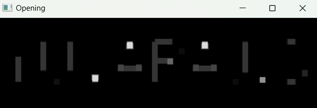
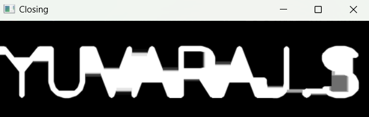

# Opening-and-Closing

## Aim
To implement Opening and Closing using Python and OpenCV.

## Software Required
1. Anaconda - Python 3.7
2. OpenCV
## Algorithm:
### Step1:
Import the necessary packages.
### Step2:
Create the Text using cv2.putText
### Step3:
Create the structuring element.
### Step4:
Use Opening operation.
### Step5:
Use Closing Operation.
## Program:
# Import the necessary packages
```python
# Developed by : YUVARAJ.S
# Resister Number : 22008589
import cv2
import numpy as np
import matplotlib.pyplot as plt
```


# Create the Text using cv2.putText
```python
# Developed by : YUVARAJ.S
# Resister Number : 22008589
img1=np.zeros((200,500),dtype='uint8')
font=cv2.FONT_ITALIC
img2=cv2.putText(img1,"YUVARAJ.S",(5,100),font,3,(255,0,0),5,cv2.LINE_AA)
cv2.imshow("Original",img2)
cv2.waitKey(0)
cv2.destroyAllWindows()
```


# Create the structuring element
```python
# Developed by : YUVARAJ.S
# Resister Number : 22008589
kernel1=cv2.getStructuringElement(cv2.MORPH_RECT,(21,21))
kernel2=cv2.getStructuringElement(cv2.MORPH_RECT,(9,9))
```


# Use Opening operation
```python
# Developed by : YUVARAJ.S
# Resister Number : 22008589
img4=cv2.morphologyEx(img1,cv2.MORPH_OPEN,kernel2)
cv2.imshow("Opening",img4)
cv2.waitKey(0)
cv2.destroyAllWindows()
```


# Use Closing Operation
```python
# Developed by : YUVARAJ.S
# Resister Number : 22008589
img3=cv2.morphologyEx(img1,cv2.MORPH_CLOSE,kernel1)
cv2.imshow("Closing",img3)
cv2.waitKey(0)
cv2.destroyAllWindows()
```
## Output:

### Display the input Image

### Display the result of Opening

### Display the result of Closing

## Result
Thus the Opening and Closing operation is used in the image using python and OpenCV.